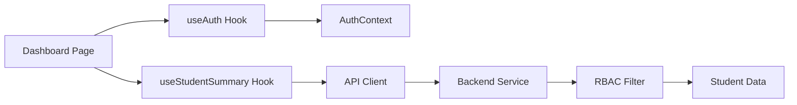

# Product Requirements Planning (PRP) - Phase 4.2 Dashboard Page Implementation

**Product**: Teacher Report Card Assistant  
**Feature**: Dashboard Page with Role-Based Student Overview  
**Phase**: 4.2 - Frontend Dashboard Implementation  
**PRP Date**: August 14, 2025  
**Estimated Duration**: 2 hours  
**Priority**: High (Core MVP Requirement)  

---

## 🎯 **Executive Summary**

Implement the main dashboard page that provides teachers with a comprehensive overview of their students, featuring role-based access control, performance indicators, and intuitive navigation. This dashboard serves as the central hub for accessing student information and report generation functionality.

**Success Metrics:**
- Form teachers can view assigned students only
- Year heads can view all school students  
- Performance bands display correctly (Outstanding ≥85%, Good 70-84%, etc.)
- Dashboard loads under 2 seconds with smooth navigation
- Responsive design works on tablet/desktop devices

---

## 📋 **Requirements Analysis**

### **Functional Requirements**

#### FR1: Role-Based Student Display
- **Form Teachers**: Display only students from assigned classes
- **Year Heads**: Display all students within their school
- Multi-tenant isolation prevents cross-school data access
- User role badge visible in header for context

#### FR2: Student List with Performance Indicators
- Student name, student ID, and class information
- Current performance band with color coding:
  - 🟢 Outstanding (≥85%) - Green indicator
  - 🔵 Good (70-84%) - Blue indicator  
  - 🟡 Satisfactory (55-69%) - Yellow indicator
  - 🔴 Needs Improvement (<55%) - Red indicator
- Grade completion status per term (e.g., "12/12 grades recorded")
- Latest term average score display

#### FR3: Summary Statistics
- Total student count for current user's access level
- Performance band distribution (bar chart or pie chart)
- Grade completion progress across all students
- Recent activity summary

#### FR4: Quick Actions & Navigation
- "Generate Report" button for each student row
- Search functionality to filter students by name
- Sort options: Name (A-Z), Performance Band, Average Score
- Pagination for large student lists (>20 students)

#### FR5: Dashboard Layout & Navigation  
- Professional header with school name, user info, and logout
- Breadcrumb navigation structure
- Side navigation or tab structure for future pages
- Responsive layout for tablet/desktop usage

### **Non-Functional Requirements**

#### NFR1: Performance
- Initial page load under 2 seconds
- Student data fetching under 1 second
- Smooth interactions with loading states
- Efficient API calls with proper caching

#### NFR2: Security & Access Control
- Session-based authentication validation
- RBAC enforcement on frontend and backend
- No sensitive data exposure in browser DevTools
- Secure API communication with Docker service names

#### NFR3: User Experience
- Loading skeletons during data fetching
- Error handling with user-friendly messages
- Empty state handling for new teachers
- Intuitive navigation with clear visual hierarchy

#### NFR4: Technical Architecture
- Docker-first development following Phase 4.1 patterns
- TypeScript strict mode compliance
- shadcn/ui component library consistency
- Next.js 15 App Router with React 19
- Responsive design principles

---

## 🏗️ **Technical Architecture**

### **Frontend Stack**
```
Next.js 15 App Router + React 19 + TypeScript 5
├── shadcn/ui components (Button, Card, Input, Label + new Table, Badge)
├── AuthContext for session management 
├── API client with Docker service name communication
├── Tailwind CSS for responsive styling
└── React Query for data fetching & caching
```

### **Backend Integration**
```
Existing FastAPI Endpoints (Phase 3 ✅):
├── GET /api/v1/students/summary/overview (primary dashboard data)
├── GET /api/v1/students (detailed student list)
├── GET /api/v1/auth/me (user context)
└── All endpoints include RBAC filtering
```

### **Data Flow Architecture**


---

## 🔧 **Implementation Blueprint**

### **Phase 1: Core Dashboard Layout (45 minutes)**

#### **Task 1.1: Create Dashboard Page Structure**
```typescript
// frontend/src/app/dashboard/page.tsx
export default function DashboardPage() {
  return (
    <div className="container mx-auto px-4 py-6">
      <DashboardHeader />
      <DashboardStats />
      <StudentTable />
    </div>
  )
}
```

#### **Task 1.2: Build Dashboard Header Component**
```typescript
// frontend/src/components/dashboard/DashboardHeader.tsx
interface DashboardHeaderProps {
  user: User;
  studentCount: number;
}

export function DashboardHeader({ user, studentCount }: DashboardHeaderProps) {
  return (
    <div className="mb-6">
      <div className="flex justify-between items-center">
        <div>
          <h1 className="text-2xl font-bold text-gray-900">Dashboard</h1>
          <p className="text-gray-600">
            {user.role === 'form_teacher' ? 'Your assigned students' : `All students in ${user.school_name}`}
          </p>
        </div>
        <div className="text-right">
          <p className="text-sm text-gray-500">Welcome back,</p>
          <p className="font-semibold">{user.full_name}</p>
          <Badge variant={user.role === 'year_head' ? 'default' : 'secondary'}>
            {user.role === 'year_head' ? 'Year Head' : 'Form Teacher'}
          </Badge>
        </div>
      </div>
    </div>
  )
}
```

#### **Task 1.3: Implement Summary Statistics Component**
```typescript
// frontend/src/components/dashboard/DashboardStats.tsx
interface StatsData {
  totalStudents: number;
  performanceBands: {
    outstanding: number;
    good: number;
    satisfactory: number;
    needsImprovement: number;
  };
  gradeCompletion: number; // percentage
}

export function DashboardStats({ stats }: { stats: StatsData }) {
  return (
    <div className="grid grid-cols-1 md:grid-cols-4 gap-4 mb-6">
      <StatCard title="Total Students" value={stats.totalStudents} />
      <StatCard 
        title="Outstanding" 
        value={stats.performanceBands.outstanding} 
        color="green" 
      />
      <StatCard 
        title="Grade Completion" 
        value={`${stats.gradeCompletion}%`} 
      />
      <StatCard title="Recent Activity" value="3 reports generated" />
    </div>
  )
}
```

### **Phase 2: Student Data Integration (45 minutes)**

#### **Task 2.1: Create Student Data Hooks**
```typescript
// frontend/src/hooks/useStudents.ts
export function useStudentSummary() {
  return useQuery({
    queryKey: ['students', 'summary'],
    queryFn: () => apiClient.get('/students/summary/overview'),
    staleTime: 5 * 60 * 1000, // 5 minutes cache
  })
}

export function useStudentStats() {
  return useQuery({
    queryKey: ['dashboard', 'stats'],
    queryFn: async () => {
      const students = await apiClient.get('/students/summary/overview')
      return calculateDashboardStats(students)
    },
  })
}
```

#### **Task 2.2: Build Student Table Component**
```typescript
// frontend/src/components/dashboard/StudentTable.tsx
interface StudentSummary {
  id: number;
  student_id: string;
  full_name: string;
  class_name: string;
  performance_band: string;
  average_score: number;
  total_grades: number;
  latest_term: string;
}

export function StudentTable() {
  const { data: students, isLoading, error } = useStudentSummary()
  const [searchQuery, setSearchQuery] = useState('')
  const [sortBy, setSortBy] = useState<'name' | 'performance' | 'score'>('name')

  if (isLoading) return <StudentTableSkeleton />
  if (error) return <ErrorMessage message="Failed to load students" />
  if (!students?.length) return <EmptyState message="No students found" />

  return (
    <Card>
      <CardHeader>
        <div className="flex justify-between items-center">
          <CardTitle>Students Overview</CardTitle>
          <div className="flex gap-2">
            <Input 
              placeholder="Search students..." 
              value={searchQuery}
              onChange={(e) => setSearchQuery(e.target.value)}
              className="w-64"
            />
            <SortSelect value={sortBy} onChange={setSortBy} />
          </div>
        </div>
      </CardHeader>
      <CardContent>
        <StudentTableContent 
          students={students}
          searchQuery={searchQuery}
          sortBy={sortBy}
        />
      </CardContent>
    </Card>
  )
}
```

#### **Task 2.3: Implement Performance Band Display**
```typescript
// frontend/src/components/dashboard/PerformanceBadge.tsx
interface PerformanceBadgeProps {
  band: 'Outstanding' | 'Good' | 'Satisfactory' | 'Needs Improvement';
  score: number;
}

export function PerformanceBadge({ band, score }: PerformanceBadgeProps) {
  const getVariant = (band: string) => {
    switch (band) {
      case 'Outstanding': return 'default' // green
      case 'Good': return 'secondary' // blue
      case 'Satisfactory': return 'outline' // yellow
      case 'Needs Improvement': return 'destructive' // red
      default: return 'outline'
    }
  }

  return (
    <div className="flex items-center gap-2">
      <Badge variant={getVariant(band)}>
        {band}
      </Badge>
      <span className="text-sm text-gray-600">{score.toFixed(1)}%</span>
    </div>
  )
}
```

### **Phase 3: Interactive Features & Polish (30 minutes)**

#### **Task 3.1: Migrate to Zod Validation & Add Search/Sort Functionality**

**Zod Migration (10 minutes):**
```typescript
// frontend/src/lib/schemas.ts - NEW FILE
import { z } from 'zod'

// Dashboard-specific validation schemas
export const StudentSearchSchema = z.object({
  query: z.string().max(100, 'Search query too long').optional(),
  sortBy: z.enum(['name', 'performance', 'score']).default('name'),
  page: z.number().int().min(1).default(1),
  limit: z.number().int().min(5).max(50).default(20),
})

export const PerformanceBandSchema = z.enum([
  'Outstanding', 
  'Good', 
  'Satisfactory', 
  'Needs Improvement'
])

export const StudentSummarySchema = z.object({
  id: z.number(),
  student_id: z.string(),
  full_name: z.string().min(1).max(100),
  class_name: z.string(),
  performance_band: PerformanceBandSchema,
  average_score: z.number().min(0).max(100),
  total_grades: z.number().int().min(0),
  latest_term: z.string(),
})

// Replace existing validation functions
export const validateStudentSearch = (data: unknown) => {
  return StudentSearchSchema.safeParse(data)
}

// Type inference from schemas
export type StudentSearchParams = z.infer<typeof StudentSearchSchema>
export type PerformanceBand = z.infer<typeof PerformanceBandSchema>
export type StudentSummary = z.infer<typeof StudentSummarySchema>
```

**Search & Sort with Zod Validation (20 minutes):**
```typescript
// frontend/src/utils/studentFilters.ts
import { StudentSearchParams, StudentSummary } from '@/lib/schemas'

export function filterAndSortStudents(
  students: StudentSummary[],
  params: StudentSearchParams
): StudentSummary[] {
  // Validate search parameters with Zod
  const validatedParams = StudentSearchSchema.parse(params)
  const { query = '', sortBy } = validatedParams

  let filtered = students.filter(student =>
    query === '' || 
    student.full_name.toLowerCase().includes(query.toLowerCase()) ||
    student.student_id.toLowerCase().includes(query.toLowerCase())
  )

  return filtered.sort((a, b) => {
    switch (sortBy) {
      case 'name':
        return a.full_name.localeCompare(b.full_name)
      case 'performance':
        return getPerformanceOrder(a.performance_band) - getPerformanceOrder(b.performance_band)
      case 'score':
        return b.average_score - a.average_score
      default:
        return 0
    }
  })
}

// Performance band ordering for sorting
function getPerformanceOrder(band: PerformanceBand): number {
  const order = {
    'Outstanding': 1,
    'Good': 2, 
    'Satisfactory': 3,
    'Needs Improvement': 4
  }
  return order[band] || 5
}
```

#### **Task 3.2: Implement Loading States & Error Handling**
```typescript
// frontend/src/components/dashboard/StudentTableSkeleton.tsx
export function StudentTableSkeleton() {
  return (
    <Card>
      <CardHeader>
        <Skeleton className="h-6 w-48" />
      </CardHeader>
      <CardContent>
        <div className="space-y-4">
          {Array.from({ length: 5 }).map((_, i) => (
            <div key={i} className="flex justify-between items-center">
              <div className="space-y-2">
                <Skeleton className="h-4 w-32" />
                <Skeleton className="h-3 w-24" />
              </div>
              <Skeleton className="h-6 w-20" />
            </div>
          ))}
        </div>
      </CardContent>
    </Card>
  )
}
```

#### **Task 3.3: Add Quick Actions**
```typescript
// frontend/src/components/dashboard/StudentActions.tsx
interface StudentActionsProps {
  student: StudentSummary;
}

export function StudentActions({ student }: StudentActionsProps) {
  const router = useRouter()

  const handleGenerateReport = () => {
    router.push(`/reports/generate/${student.id}`)
  }

  const handleViewDetails = () => {
    router.push(`/students/${student.id}`)
  }

  return (
    <div className="flex gap-2">
      <Button size="sm" onClick={handleGenerateReport}>
        Generate Report
      </Button>
      <Button size="sm" variant="outline" onClick={handleViewDetails}>
        View Details
      </Button>
    </div>
  )
}
```

---

## ✅ **Validation Gates**

### **Gate 1: Authentication & Authorization (10 minutes)**
```bash
# Test role-based access
# 1. Login as Form Teacher
curl -c cookies.txt -X POST http://backend:8000/api/v1/auth/login \
  -H "Content-Type: application/json" \
  -d '{"email": "tan@rps.edu.sg", "password": "'"$SEED_DEFAULT_PASSWORD"'"}'

# 2. Verify assigned students only (should return 4 students)
curl -b cookies.txt http://backend:8000/api/v1/students/summary/overview

# 3. Login as Year Head  
curl -c cookies_yearhead.txt -X POST http://backend:8000/api/v1/auth/login \
  -H "Content-Type: application/json" \
  -d '{"email": "lim@rps.edu.sg", "password": "'"$SEED_DEFAULT_PASSWORD"'"}'

# 4. Verify full school access (should return 4 students from same school)
curl -b cookies_yearhead.txt http://backend:8000/api/v1/students/summary/overview
```

**Success Criteria:**
- ✅ Form teacher sees only assigned students (4 students)
- ✅ Year head sees all school students (4 students)
- ✅ Different schools return different student sets
- ✅ Performance bands calculate correctly

### **Gate 2: Frontend Integration (15 minutes)**
```bash
# Start Docker services
docker compose up -d

# Test frontend connectivity
NETWORK_NAME=$(docker network ls | grep report-card-assistant | awk '{print $2}' | head -1)
docker run --rm --network $NETWORK_NAME alpine/curl curl -f http://backend:8000/health

# Navigate to dashboard and verify:
# 1. Login redirects to /dashboard
# 2. Student data loads with performance bands
# 3. Search functionality works
# 4. Role badge displays correctly
# 5. Statistics calculate properly
```

**Success Criteria:**
- ✅ Dashboard loads within 2 seconds
- ✅ Student performance bands display with correct colors
- ✅ Search filters students in real-time
- ✅ Role-based data filtering works correctly
- ✅ No JavaScript console errors

### **Gate 3: User Experience Validation (10 minutes)**
```typescript
// Manual testing checklist:
const UX_VALIDATION_CHECKLIST = [
  "✅ Loading states display during API calls",
  "✅ Error messages are user-friendly and actionable", 
  "✅ Empty state shows helpful message for new teachers",
  "✅ Performance band colors are intuitive (green=good, red=needs help)",
  "✅ Responsive layout works on tablet (768px+)",
  "✅ Navigation breadcrumbs are clear",
  "✅ Sort options work correctly",
  "✅ Student actions (Generate Report) navigate properly"
]
```

### **Gate 4: Security & Performance (10 minutes)**
```bash
# Security validation
# 1. Verify no sensitive data in DevTools Network tab
# 2. Confirm session cookies are HTTP-only
# 3. Test cross-school access prevention
# 4. Validate RBAC enforcement

# Performance validation  
# 1. Lighthouse audit score >90 for performance
# 2. API response times <1 second
# 3. No memory leaks in React DevTools
```

---

## 🚨 **Risk Assessment & Mitigation**

### **High-Risk Areas**

#### **Risk 1: Role-Based Data Filtering**
- **Risk**: Form teachers seeing unauthorized student data
- **Probability**: Medium | **Impact**: High  
- **Mitigation**: Double validation on frontend and backend, extensive testing with different user roles
- **Contingency**: Backend RBAC is primary defense, frontend filtering is UI convenience

#### **Risk 2: Performance with Large Student Lists**
- **Risk**: Dashboard becomes slow with >100 students (Year Heads)
- **Probability**: Low | **Impact**: Medium
- **Mitigation**: Implement pagination, virtual scrolling, and API response caching
- **Contingency**: Start with simple pagination, upgrade to virtual scrolling if needed

### **Medium-Risk Areas**

#### **Risk 3: Docker Network Communication**
- **Risk**: Frontend cannot reach backend service
- **Probability**: Low | **Impact**: High
- **Mitigation**: Follow established Phase 4.1 patterns, test network connectivity
- **Contingency**: Network troubleshooting procedures documented in learnings

#### **Risk 4: Complex State Management**
- **Risk**: Dashboard state becomes complex with search, sort, filters
- **Probability**: Medium | **Impact**: Low
- **Mitigation**: Use React Query for server state, simple useState for UI state
- **Contingency**: Refactor to Zustand if complexity increases

---

## 📊 **Success Metrics & KPIs**

### **Technical Metrics**
- **Page Load Time**: <2 seconds (target: 1.5 seconds)
- **API Response Time**: <1 second for student data
- **JavaScript Bundle Size**: <500KB gzipped
- **Lighthouse Performance Score**: >90

### **User Experience Metrics**
- **Time to Student Information**: <3 seconds from login
- **Search Response Time**: <200ms after typing
- **Error Rate**: <1% for API calls
- **Mobile Responsiveness**: Works on tablets 768px+

### **Business Metrics**
- **Feature Completion**: 100% of Phase 4.2 requirements
- **RBAC Accuracy**: 0 unauthorized data access incidents
- **User Adoption**: Teachers can complete dashboard tasks without guidance

---

## 📚 **Dependencies & Integration**

### **External Dependencies**
- **shadcn/ui Components**: Button, Card, Input, Label (existing) + Table, Badge, Skeleton (new)
- **React Query**: For data fetching and caching (new dependency)
- **Zod**: For TypeScript-first validation (new dependency) 
- **Lucide React**: For icons (if not already installed)

### **Internal Dependencies**
- **Phase 4.1**: ✅ Authentication system and AuthContext
- **Phase 3.2**: ✅ Grade management APIs and performance band calculation
- **Phase 1-2**: ✅ Backend infrastructure and RBAC system

### **Future Integration Points**
- **Phase 4.3**: Report generation page will use student selection from dashboard
- **Phase 5.1**: PDF generation will integrate with dashboard student data
- **Future Phases**: Dashboard will serve as navigation hub for additional features

---

## 🔧 **Development Environment Setup**

### **Required Docker Commands**
```bash
# Ensure backend and database are running
docker compose up -d db backend

# Install new frontend dependencies (React Query, Zod, icons)
docker compose exec frontend npm install @tanstack/react-query zod lucide-react

# Add new shadcn/ui components
docker compose exec frontend npx shadcn-ui@latest add table badge skeleton

# Start development server
docker compose up frontend
```

### **Development Workflow**
```bash
# 1. Start all services
docker compose up -d

# 2. Verify backend connectivity
NETWORK_NAME=$(docker network ls | grep report-card-assistant | awk '{print $2}' | head -1)
docker run --rm --network $NETWORK_NAME alpine/curl curl -f http://backend:8000/api/v1/students/summary/overview

# 3. Access frontend
open http://localhost:3000

# 4. Login with test credentials
# Form Teacher: tan@rps.edu.sg / ${SEED_DEFAULT_PASSWORD}
# Year Head: lim@rps.edu.sg / ${SEED_DEFAULT_PASSWORD}
```

---

## 📝 **Implementation Checklist**

### **Core Dashboard Components**
- [ ] `dashboard/page.tsx` - Main dashboard page
- [ ] `components/dashboard/DashboardHeader.tsx` - Header with user info
- [ ] `components/dashboard/DashboardStats.tsx` - Summary statistics
- [ ] `components/dashboard/StudentTable.tsx` - Student data table
- [ ] `components/dashboard/PerformanceBadge.tsx` - Performance band display
- [ ] `components/dashboard/StudentActions.tsx` - Quick action buttons

### **Data & State Management**
- [ ] `lib/schemas.ts` - Zod validation schemas and TypeScript types
- [ ] `hooks/useStudents.ts` - Student data fetching hooks
- [ ] `utils/studentFilters.ts` - Search and sort utilities with Zod validation
- [ ] React Query setup and configuration
- [ ] **Zod Migration**: Replace existing regex validation with Zod schemas

### **UI Components & Styling**
- [ ] Install and configure React Query + Zod
- [ ] Add shadcn/ui Table, Badge, Skeleton components  
- [ ] Create Zod validation schemas for dashboard data
- [ ] Responsive layout with Tailwind CSS
- [ ] Loading states and error handling
- [ ] Empty state components

### **Integration & Testing**
- [ ] Docker network communication verification
- [ ] API endpoint integration testing
- [ ] RBAC validation with test users
- [ ] Cross-browser testing (Chrome, Safari, Firefox)
- [ ] Mobile/tablet responsiveness testing

---

## ⭐ **PRP Confidence Score: 9/10**

### **Confidence Justification**

**High Confidence Factors (9/10):**
- ✅ **Established Patterns**: Phase 4.1 authentication provides proven Docker-first development patterns
- ✅ **Backend APIs Ready**: All required endpoints exist and tested (Phase 3.2 complete)
- ✅ **Component Library**: shadcn/ui components already integrated and working
- ✅ **Security Framework**: RBAC and multi-tenant isolation already implemented
- ✅ **Clear Requirements**: Dashboard functionality is well-defined and testable
- ✅ **Risk Mitigation**: Identified risks have concrete solutions and contingencies

**Minor Risk Factors (-1):**
- New React Query dependency may need configuration adjustment
- Performance optimization might require iteration for large student lists

### **One-Pass Implementation Probability**

**Expected**: All core functionality working in first pass  
**Likely Iterations**: UI polish, performance optimization, edge case handling  
**Confidence in 2-Hour Estimate**: 90% - includes buffer for testing and refinement

This PRP provides a complete implementation blueprint with executable validation gates, clear success criteria, and comprehensive risk mitigation strategies. The dashboard will serve as a robust foundation for the remaining report generation features.