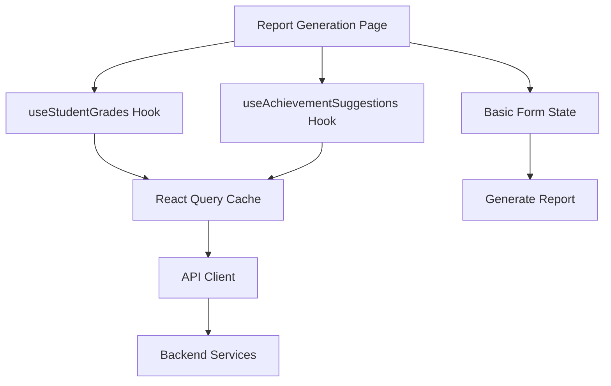

# Product Requirements Planning (PRP) - Phase 4.3 Report Generation Page

**Product**: Teacher Report Card Assistant  
**Feature**: Report Generation Page with Grade Review, Achievement Selection, and Comments  
**Phase**: 4.3 - Frontend Report Generation Implementation  
**PRP Date**: August 14, 2025  
**Estimated Duration**: 1 hour  
**Priority**: High (Core Assignment Requirement)  

---

## 🎯 **Executive Summary**

Implement a streamlined report generation interface that allows teachers to review student performance, select achievements from auto-suggestions, add behavioral comments, and initiate PDF report generation. This page focuses on the core assignment requirements: reviewing recorded grades and preparing report content.

**Success Metrics:**
- Teachers can review recorded grades for all subjects (English, Math, Science, Chinese)
- Auto-suggested achievements load with relevance scores and explanations
- Comments section supports behavioral observations with character counter
- Achievement selection works with checkbox inclusion/exclusion
- Generate Report button initiates PDF creation process (Phase 5.1)

---

## 📋 **Requirements Analysis**

### **Functional Requirements**

#### FR1: Student Information Header with Term Selection
- Display student name, student ID, class, and school information
- Term selector dropdown for navigating between academic terms
- Breadcrumb navigation back to dashboard
- Current performance band display with color coding
- Last modified timestamp and user information

#### FR2: Grade Review Section (Assignment Requirement: "Review student's recent performance")
- Display existing grades for all 4 subjects: English, Math, Science, Chinese (read-only)
- Show previous term grades for comparison
- Display calculated current term average and performance band
- Visual indicators for grade improvements (green arrow up, red down)
- Performance trends and historical context

#### FR3: Achievement Selection Section with Auto-Suggestions
- API-powered achievement suggestions based on grade patterns
- Checkbox interface for including/excluding each suggestion
- Achievement cards showing:
  - Title and description
  - Category (e.g., "Academic Improvement", "Excellence")
  - Relevance score (0.0-1.0) with visual indicator
  - Explanation of why suggested (e.g., "20% improvement in Math")
- Option to add custom achievements with title/description input
- Selected achievements counter and validation (minimum 1, maximum 8)

#### FR4: Behavioral Comments Section (Assignment Requirement: "behavior comments")
- Large textarea for teacher behavioral observations
- Character counter (0/500 characters) with color coding
- Simple form validation for required fields

#### FR5: Report Actions (Assignment Requirement: "Generate & export professional report")
- Generate Report button - validates data and triggers PDF creation (Phase 5.1)
- Basic form validation to ensure required data is present
- Loading states for report generation process

### **Non-Functional Requirements**

#### NFR1: Security and Authorization (Assignment Requirement: "Code security")
- RBAC enforcement - only accessible students can be viewed
- No sensitive data exposure in browser DevTools
- Session validation with automatic redirect to login if expired
- Input sanitization to prevent XSS attacks
- Secure API communication following established Docker patterns

---

## 🏗️ **Technical Architecture**

### **Frontend Technology Stack**
```
Next.js 15 App Router + React 19 + TypeScript 5
├── Basic React State - Simple state management for form
├── Zod - TypeScript-first validation (established pattern)
├── React Query - API state management (established pattern) 
├── shadcn/ui - UI components (Button, Card, Textarea, Select, Checkbox)
├── AuthContext - Session management (established)
└── Tailwind CSS - Responsive styling (established)
```

### **Backend API Integration**
```
Required API Endpoints:
├── GET /api/v1/students/{student_id} ✅ (existing)
├── GET /api/v1/grades/students/{student_id}/terms/{term_id} ✅ (existing) 
├── GET /api/v1/achievements/suggest/{student_id}/{term_id} ✅ (existing)
└── All endpoints include RBAC filtering ✅ (established)

Note: Subjects and terms can be extracted from existing grade data
```

### **Simplified Form State with Zod**
```typescript
interface ReportFormData {
  studentId: number;
  termId: number;
  selectedAchievements: number[]; // achievement IDs
  behavioralComments: string;
}

// Zod validation (keeping established pattern)
const reportFormSchema = z.object({
  selectedAchievements: z.array(z.number()).min(1, "At least one achievement must be selected"),
  behavioralComments: z.string()
    .min(1, "Behavioral comments are required")
    .max(500, "Comments must be under 500 characters"),
});

// Use basic React state + Zod validation (no React Hook Form complexity)
const validateForm = (data: Pick<ReportFormData, 'selectedAchievements' | 'behavioralComments'>) => {
  return reportFormSchema.safeParse(data);
};
```

### **Data Flow Architecture**


---

## 🔧 **Implementation Blueprint**

### **Phase 1: Page Structure and Components (25 minutes)**

#### **Task 1.2: Create Report Generation Page Route**
```typescript
// frontend/src/app/reports/generate/[studentId]/page.tsx
interface ReportGeneratePageProps {
  params: { studentId: string }
  searchParams: { termId?: string }
}

export default function ReportGeneratePage({ 
  params, 
  searchParams 
}: ReportGeneratePageProps) {
  const studentId = parseInt(params.studentId)
  const termId = searchParams.termId ? parseInt(searchParams.termId) : null

  return (
    <div className="container mx-auto px-4 py-6 space-y-6">
      <StudentHeader studentId={studentId} />
      <ReportForm studentId={studentId} initialTermId={termId} />
    </div>
  )
}
```

#### **Task 1.3: Build Student Information Header Component**
```typescript
// frontend/src/components/reports/StudentHeader.tsx
interface StudentHeaderProps {
  studentId: number;
  selectedTermId?: number;
  onTermChange: (termId: number) => void;
}

export function StudentHeader({ 
  studentId, 
  selectedTermId, 
  onTermChange 
}: StudentHeaderProps) {
  const { data: student } = useStudent(studentId)
  const { data: terms } = useSchoolTerms()

  return (
    <Card>
      <CardHeader>
        <div className="flex items-center justify-between">
          <div>
            <Breadcrumb>
              <BreadcrumbItem>
                <Link href="/dashboard">Dashboard</Link>
              </BreadcrumbItem>
              <BreadcrumbItem>Generate Report</BreadcrumbItem>
            </Breadcrumb>
            <CardTitle className="mt-2">
              {student?.full_name} ({student?.student_id})
            </CardTitle>
            <CardDescription>
              {student?.class_name} • {student?.school_name}
            </CardDescription>
          </div>
          <div className="text-right">
            <Select value={selectedTermId?.toString()} onValueChange={(value) => onTermChange(parseInt(value))}>
              <SelectTrigger className="w-40">
                <SelectValue placeholder="Select term" />
              </SelectTrigger>
              <SelectContent>
                {terms?.map((term) => (
                  <SelectItem key={term.id} value={term.id.toString()}>
                    {term.name}
                  </SelectItem>
                ))}
              </SelectContent>
            </Select>
          </div>
        </div>
      </CardHeader>
    </Card>
  )
}
```

### **Phase 2: Grade Review Section (20 minutes)**

#### **Task 2.1: Create Grade Display Component (Read-Only)**
```typescript
// frontend/src/components/reports/GradeReview.tsx
interface GradeReviewProps {
  studentId: number;
  termId: number;
}

export function GradeReview({ studentId, termId }: GradeReviewProps) {
  const { data: currentGrades } = useStudentTermGrades(studentId, termId)
  const { data: previousGrades } = useStudentTermGrades(studentId, termId - 1)
  
  const calculateAverage = (grades: GradeResponse[]) => {
    if (!grades?.length) return 0
    const sum = grades.reduce((acc, grade) => acc + parseFloat(grade.score.toString()), 0)
    return sum / grades.length
  }

  const getPerformanceBand = (average: number) => {
    if (average >= 85) return { label: "Outstanding", color: "bg-green-100 text-green-800" }
    if (average >= 70) return { label: "Good", color: "bg-blue-100 text-blue-800" }
    if (average >= 55) return { label: "Satisfactory", color: "bg-yellow-100 text-yellow-800" }
    return { label: "Needs Improvement", color: "bg-red-100 text-red-800" }
  }

  const currentAverage = calculateAverage(currentGrades?.grades || [])
  const previousAverage = calculateAverage(previousGrades?.grades || [])
  const performanceBand = getPerformanceBand(currentAverage)

  return (
    <Card>
      <CardHeader>
        <CardTitle>Grade Review</CardTitle>
        <CardDescription>
          Review recorded grades for Term {termId}. Grades are already recorded in the system.
        </CardDescription>
      </CardHeader>
      <CardContent>
        <div className="grid grid-cols-1 md:grid-cols-2 gap-6">
          {/* Current Term Grades (Read-Only Display) */}
          <div>
            <h3 className="font-semibold mb-4">Current Term Grades</h3>
            <div className="space-y-3">
              {currentGrades?.grades?.map((grade) => {
                const prevGrade = previousGrades?.grades?.find(g => g.subject_id === grade.subject_id)
                const improvement = prevGrade ? 
                  parseFloat(grade.score.toString()) - parseFloat(prevGrade.score.toString()) : null

                return (
                  <div key={grade.id} className="flex justify-between items-center p-3 bg-gray-50 rounded-lg">
                    <div>
                      <span className="font-medium">{grade.subject.name}</span>
                      <div className="text-sm text-gray-500">{grade.subject.code}</div>
                    </div>
                    <div className="text-right">
                      <div className="text-lg font-bold">
                        {parseFloat(grade.score.toString()).toFixed(1)}
                        <span className="text-sm text-gray-500 ml-1">/ 100</span>
                      </div>
                      {improvement !== null && (
                        <div className={`text-xs flex items-center justify-end mt-1 ${
                          improvement > 0 ? 'text-green-600' : 
                          improvement < 0 ? 'text-red-600' : 'text-gray-500'
                        }`}>
                          {improvement > 0 ? (
                            <ArrowUpIcon className="h-3 w-3 mr-1" />
                          ) : improvement < 0 ? (
                            <ArrowDownIcon className="h-3 w-3 mr-1" />
                          ) : null}
                          {improvement > 0 ? '+' : ''}{improvement.toFixed(1)} from last term
                        </div>
                      )}
                    </div>
                  </div>
                )
              })}
            </div>

            {/* Current Performance Summary */}
            <div className="mt-6 p-4 bg-blue-50 rounded-lg border border-blue-200">
              <div className="flex justify-between items-center mb-2">
                <span className="font-medium">Term Average:</span>
                <span className="text-xl font-bold text-blue-700">
                  {currentAverage.toFixed(1)}%
                </span>
              </div>
              <div className="flex justify-between items-center">
                <span>Performance Band:</span>
                <span className={`px-2 py-1 rounded-full text-xs font-medium ${performanceBand.color}`}>
                  {performanceBand.label}
                </span>
              </div>
              {previousAverage > 0 && (
                <div className="mt-2 pt-2 border-t border-blue-200">
                  <div className={`text-sm ${
                    currentAverage > previousAverage ? 'text-green-600' : 
                    currentAverage < previousAverage ? 'text-red-600' : 'text-gray-600'
                  }`}>
                    {currentAverage > previousAverage ? '↗' : currentAverage < previousAverage ? '↘' : '→'} 
                    {currentAverage > previousAverage ? '+' : ''}
                    {(currentAverage - previousAverage).toFixed(1)} from previous term
                  </div>
                </div>
              )}
            </div>
          </div>

          {/* Previous Term Comparison */}
          <div>
            <h3 className="font-semibold mb-4">Previous Term (Reference)</h3>
            {previousGrades?.grades?.length ? (
              <div className="space-y-3">
                {previousGrades.grades.map((grade) => (
                  <div key={grade.id} className="flex justify-between items-center p-3 bg-gray-100 rounded-lg">
                    <span className="font-medium">{grade.subject.name}</span>
                    <div className="text-right">
                      <span className="text-lg font-semibold text-gray-700">
                        {parseFloat(grade.score.toString()).toFixed(1)}
                      </span>
                      <span className="text-sm text-gray-500 ml-1">/ 100</span>
                    </div>
                  </div>
                ))}
                <div className="mt-4 p-3 bg-gray-200 rounded-lg">
                  <div className="flex justify-between items-center">
                    <span className="text-sm font-medium text-gray-700">Previous Average:</span>
                    <span className="text-lg font-bold text-gray-700">
                      {previousAverage.toFixed(1)}%
                    </span>
                  </div>
                </div>
              </div>
            ) : (
              <div className="text-center py-8 text-gray-500">
                <div className="text-sm">No previous term data available</div>
                <div className="text-xs mt-1">This might be the student's first term</div>
              </div>
            )}
          </div>
        </div>
      </CardContent>
    </Card>
  )
}
```

### **Phase 3: Achievement Selection with Auto-Suggestions (35 minutes)**

#### **Task 3.1: Create Achievement Suggestions Component**
```typescript
// frontend/src/components/reports/AchievementSelection.tsx
interface AchievementSelectionProps {
  studentId: number;
  termId: number;
  onSelectionChange: (achievements: SelectedAchievement[]) => void;
}

interface SelectedAchievement {
  id?: number; // undefined for custom achievements
  title: string;
  description: string;
  isCustom: boolean;
}

export function AchievementSelection({ 
  studentId, 
  termId, 
  onSelectionChange 
}: AchievementSelectionProps) {
  const { data: suggestions, isLoading } = useAchievementSuggestions(studentId, termId)
  const [selectedIds, setSelectedIds] = useState<number[]>([])
  const [customAchievements, setCustomAchievements] = useState<CustomAchievement[]>([])
  const [showCustomForm, setShowCustomForm] = useState(false)

  const handleSuggestionToggle = (suggestionId: number) => {
    setSelectedIds(prev => 
      prev.includes(suggestionId) 
        ? prev.filter(id => id !== suggestionId)
        : [...prev, suggestionId]
    )
  }

  const handleCustomAchievementAdd = (achievement: CustomAchievement) => {
    setCustomAchievements(prev => [...prev, achievement])
    setShowCustomForm(false)
  }

  // Update parent component when selection changes
  useEffect(() => {
    const selectedSuggestions = suggestions?.suggestions
      .filter(s => selectedIds.includes(s.id))
      .map(s => ({
        id: s.id,
        title: s.title,
        description: s.description,
        isCustom: false
      })) || []

    const customSelected = customAchievements.map(c => ({
      title: c.title,
      description: c.description,
      isCustom: true
    }))

    onSelectionChange([...selectedSuggestions, ...customSelected])
  }, [selectedIds, customAchievements, suggestions, onSelectionChange])

  if (isLoading) {
    return <AchievementSelectionSkeleton />
  }

  return (
    <Card>
      <CardHeader>
        <CardTitle>Achievement Selection</CardTitle>
        <CardDescription>
          Select achievements based on {suggestions?.student_name}'s performance. 
          {selectedIds.length + customAchievements.length}/8 selected
        </CardDescription>
      </CardHeader>
      <CardContent>
        {/* Auto-suggested Achievements */}
        <div className="mb-6">
          <h3 className="font-semibold mb-3">Suggested Achievements</h3>
          {suggestions?.suggestions.length === 0 ? (
            <p className="text-gray-500 text-sm">
              No achievements suggested based on current performance data.
            </p>
          ) : (
            <div className="grid grid-cols-1 md:grid-cols-2 gap-4">
              {suggestions?.suggestions.map((suggestion) => (
                <AchievementCard
                  key={suggestion.title}
                  suggestion={suggestion}
                  isSelected={selectedIds.includes(suggestion.id)}
                  onToggle={() => handleSuggestionToggle(suggestion.id)}
                  disabled={!selectedIds.includes(suggestion.id) && 
                           (selectedIds.length + customAchievements.length) >= 8}
                />
              ))}
            </div>
          )}
        </div>

        {/* Custom Achievements */}
        <div>
          <div className="flex justify-between items-center mb-3">
            <h3 className="font-semibold">Custom Achievements</h3>
            <Button 
              variant="outline" 
              size="sm"
              onClick={() => setShowCustomForm(true)}
              disabled={(selectedIds.length + customAchievements.length) >= 8}
            >
              <PlusIcon className="h-4 w-4 mr-2" />
              Add Custom
            </Button>
          </div>

          {customAchievements.length === 0 ? (
            <p className="text-gray-500 text-sm">
              No custom achievements added yet.
            </p>
          ) : (
            <div className="space-y-3">
              {customAchievements.map((achievement, index) => (
                <CustomAchievementCard
                  key={index}
                  achievement={achievement}
                  onRemove={() => setCustomAchievements(prev => 
                    prev.filter((_, i) => i !== index)
                  )}
                />
              ))}
            </div>
          )}
        </div>

        {/* Custom Achievement Form Modal */}
        {showCustomForm && (
          <CustomAchievementForm
            onSave={handleCustomAchievementAdd}
            onCancel={() => setShowCustomForm(false)}
          />
        )}
      </CardContent>
    </Card>
  )
}

// Achievement Card Component
interface AchievementCardProps {
  suggestion: AchievementSuggestionResponse;
  isSelected: boolean;
  onToggle: () => void;
  disabled: boolean;
}

function AchievementCard({ 
  suggestion, 
  isSelected, 
  onToggle, 
  disabled 
}: AchievementCardProps) {
  const getRelevanceColor = (score: number) => {
    if (score >= 0.8) return 'text-green-600 bg-green-50 border-green-200'
    if (score >= 0.6) return 'text-blue-600 bg-blue-50 border-blue-200'
    if (score >= 0.4) return 'text-yellow-600 bg-yellow-50 border-yellow-200'
    return 'text-gray-600 bg-gray-50 border-gray-200'
  }

  return (
    <div className={`border rounded-lg p-4 cursor-pointer transition-colors ${
      isSelected 
        ? 'border-blue-500 bg-blue-50' 
        : disabled 
          ? 'border-gray-200 bg-gray-50 opacity-50' 
          : 'border-gray-200 hover:border-gray-300'
    }`} onClick={disabled ? undefined : onToggle}>
      <div className="flex items-start space-x-3">
        <Checkbox
          checked={isSelected}
          disabled={disabled}
          className="mt-1"
        />
        <div className="flex-1 min-w-0">
          <div className="flex justify-between items-start mb-2">
            <h4 className="font-medium text-sm">{suggestion.title}</h4>
            <div className={`px-2 py-1 rounded text-xs border ${getRelevanceColor(suggestion.relevance_score)}`}>
              {Math.round(suggestion.relevance_score * 100)}% match
            </div>
          </div>
          <p className="text-sm text-gray-600 mb-2">{suggestion.description}</p>
          <p className="text-xs text-gray-500">{suggestion.explanation}</p>
          <div className="mt-2">
            <Badge variant="outline" size="sm">
              {suggestion.category_name}
            </Badge>
          </div>
        </div>
      </div>
    </div>
  )
}
```

### **Phase 4: Comments Section and Form Integration (25 minutes)**

#### **Task 4.1: Behavioral Comments Component**
```typescript
// frontend/src/components/reports/BehavioralComments.tsx
interface BehavioralCommentsProps {
  value: string;
  onChange: (value: string) => void;
  maxLength: number;
}

export function BehavioralComments({ 
  value, 
  onChange, 
  maxLength = 500 
}: BehavioralCommentsProps) {
  const [showQuickPhrases, setShowQuickPhrases] = useState(false)
  
  const quickPhrases = [
    "Shows excellent participation in class discussions",
    "Demonstrates strong leadership qualities among peers",
    "Works well independently and collaboratively in groups", 
    "Shows consistent effort and determination to improve",
    "Displays positive attitude toward learning challenges",
    "Respectful and considerate toward classmates and teachers",
    "Takes initiative in completing assignments and projects",
    "Demonstrates creativity and original thinking"
  ]

  const handleQuickPhraseInsert = (phrase: string) => {
    const newValue = value ? `${value} ${phrase}` : phrase
    if (newValue.length <= maxLength) {
      onChange(newValue)
    }
    setShowQuickPhrases(false)
  }

  const getCharacterCountColor = () => {
    const percentage = value.length / maxLength
    if (percentage >= 0.9) return 'text-red-600'
    if (percentage >= 0.7) return 'text-yellow-600'
    return 'text-gray-500'
  }

  return (
    <Card>
      <CardHeader>
        <div className="flex justify-between items-center">
          <div>
            <CardTitle>Behavioral Comments</CardTitle>
            <CardDescription>
              Add observations about the student's behavior, attitude, and social skills.
            </CardDescription>
          </div>
          <Button
            variant="outline"
            size="sm"
            onClick={() => setShowQuickPhrases(!showQuickPhrases)}
          >
            Quick Phrases
          </Button>
        </div>
      </CardHeader>
      <CardContent>
        {showQuickPhrases && (
          <div className="mb-4 p-4 bg-gray-50 rounded-lg">
            <h4 className="font-medium mb-2">Quick Phrases</h4>
            <div className="grid grid-cols-1 md:grid-cols-2 gap-2">
              {quickPhrases.map((phrase, index) => (
                <Button
                  key={index}
                  variant="ghost"
                  size="sm"
                  className="justify-start text-left h-auto p-2"
                  onClick={() => handleQuickPhraseInsert(phrase)}
                  disabled={value.length + phrase.length > maxLength}
                >
                  <PlusIcon className="h-3 w-3 mr-2 flex-shrink-0" />
                  <span className="text-xs">{phrase}</span>
                </Button>
              ))}
            </div>
          </div>
        )}

        <div className="space-y-2">
          <Textarea
            value={value}
            onChange={(e) => onChange(e.target.value)}
            placeholder="Enter your observations about the student's behavior, participation, and social interactions..."
            className="min-h-[120px] resize-none"
            maxLength={maxLength}
          />
          <div className="flex justify-between items-center text-sm">
            <span className="text-gray-500">
              Comments help provide a complete picture of the student's development.
            </span>
            <span className={getCharacterCountColor()}>
              {value.length}/{maxLength} characters
            </span>
          </div>
        </div>
      </CardContent>
    </Card>
  )
}
```

#### **Task 4.2: Main Report Form Integration with Basic State + Zod**
```typescript
// frontend/src/components/reports/ReportForm.tsx
interface ReportFormProps {
  studentId: number;
  initialTermId?: number;
}

interface ReportFormData {
  selectedAchievements: number[];
  behavioralComments: string;
}

export function ReportForm({ studentId, initialTermId }: ReportFormProps) {
  const router = useRouter()
  const { data: terms } = useSchoolTerms()
  const [selectedTermId, setSelectedTermId] = useState(initialTermId || terms?.[0]?.id)
  
  // Simple React state for form data (no React Hook Form complexity)
  const [formData, setFormData] = useState<ReportFormData>({
    selectedAchievements: [],
    behavioralComments: ''
  })
  const [validationErrors, setValidationErrors] = useState<Record<string, string>>({})

  // Validate form data using Zod (keeping established pattern)
  const validateForm = (data: ReportFormData) => {
    const result = reportFormSchema.safeParse(data)
    if (!result.success) {
      const errors: Record<string, string> = {}
      result.error.errors.forEach(error => {
        errors[error.path.join('.')] = error.message
      })
      setValidationErrors(errors)
      return false
    }
    setValidationErrors({})
    return true
  }

  const handleAchievementsChange = (achievements: SelectedAchievement[]) => {
    const achievementIds = achievements
      .filter(a => !a.isCustom && a.id)
      .map(a => a.id!) // Non-null assertion safe here due to filter
    
    const updatedData = { ...formData, selectedAchievements: achievementIds }
    setFormData(updatedData)
    
    // Real-time validation
    reportFormSchema.safeParse(updatedData)
  }

  const handleCommentsChange = (comments: string) => {
    const updatedData = { ...formData, behavioralComments: comments }
    setFormData(updatedData)
    
    // Real-time validation for comments
    const commentsResult = reportFormSchema.shape.behavioralComments.safeParse(comments)
    if (!commentsResult.success) {
      setValidationErrors(prev => ({ 
        ...prev, 
        behavioralComments: commentsResult.error.errors[0].message 
      }))
    } else {
      setValidationErrors(prev => ({ ...prev, behavioralComments: '' }))
    }
  }

  const handleGenerateReport = () => {
    if (!validateForm(formData)) {
      toast.error('Please fix form errors before generating report')
      return
    }

    // Phase 5.1 will implement actual PDF generation
    console.log('Generating report with data:', {
      studentId,
      termId: selectedTermId,
      ...formData
    })
    toast.success('Report generation initiated (Phase 5.1 implementation)')
  }

  if (!selectedTermId) {
    return <div>Loading terms...</div>
  }

  return (
    <div className="space-y-6">
      {/* Student Header */}
      <StudentHeader 
        studentId={studentId}
        selectedTermId={selectedTermId}
        onTermChange={setSelectedTermId}
      />

      {/* Grade Review (Read-Only) */}
      <GradeReview
        studentId={studentId}
        termId={selectedTermId}
      />

      {/* Achievement Selection */}
      <AchievementSelection
        studentId={studentId}
        termId={selectedTermId}
        onSelectionChange={handleAchievementsChange}
      />
      {validationErrors.selectedAchievements && (
        <p className="text-sm text-red-600 -mt-4 ml-4">
          {validationErrors.selectedAchievements}
        </p>
      )}

      {/* Behavioral Comments */}
      <BehavioralComments
        value={formData.behavioralComments}
        onChange={handleCommentsChange}
        maxLength={500}
      />
      {validationErrors.behavioralComments && (
        <p className="text-sm text-red-600 -mt-4 ml-4">
          {validationErrors.behavioralComments}
        </p>
      )}

      {/* Action Buttons */}
      <div className="flex justify-end pt-6 border-t">
        <div className="flex space-x-3">
          <Button 
            variant="outline"
            onClick={() => router.push('/dashboard')}
          >
            Cancel
          </Button>
          <Button 
            onClick={handleGenerateReport}
            className="bg-blue-600 hover:bg-blue-700"
            disabled={Object.values(validationErrors).some(error => !!error)}
          >
            Generate Report
          </Button>
        </div>
      </div>
    </div>
  )
}
```

---

## ✅ **Validation Gates**

### **Gate 1: Backend API Validation (15 minutes)**
```bash
# Test missing endpoints creation
# 1. Verify subjects endpoint
curl -b cookies.txt http://backend:8000/api/v1/subjects

# 2. Verify terms endpoint  
curl -b cookies.txt http://backend:8000/api/v1/terms

# 3. Test grade updates with validation
curl -b cookies.txt -X PUT http://backend:8000/api/v1/grades/students/1/terms/1 \
  -H "Content-Type: application/json" \
  -d '{"grades": {"1": 85.5, "2": 90.0, "3": 78.5, "4": 82.0}}'

# 4. Test achievement suggestions
curl -b cookies.txt http://backend:8000/api/v1/achievements/suggest/1/1

# Success Criteria:
# - ✅ All endpoints return expected data structures
# - ✅ Grade validation works (0-100 range, decimal precision)
# - ✅ Achievement suggestions include relevance scores
# - ✅ RBAC enforcement prevents unauthorized access
```

### **Gate 2: Form Functionality Validation (20 minutes)**
```typescript
// Manual testing checklist:
const FORM_VALIDATION_TESTS = [
  "✅ Grade display shows current term scores correctly (read-only)",
  "✅ Performance band calculation and display works properly", 
  "✅ Grade improvement indicators show correctly vs previous term",
  "✅ Achievement suggestions load and display relevance scores",
  "✅ Custom achievements can be added with title/description",
  "✅ Comments character counter works correctly (500 char limit)",
  "✅ Quick phrases insert properly and respect character limit",
  "✅ Real-time Zod validation shows appropriate error messages",
  "✅ Generate Report button validates all required fields",
  "✅ Form prevents submission with validation errors",
  "✅ RBAC properly limits student access by teacher role"
]
```

### **Gate 3: User Experience Validation (15 minutes)**
```bash
# Responsive design testing
# 1. Test form layout at different breakpoints (768px, 1024px, 1280px)
# 2. Verify touch-friendly interface on tablet devices
# 3. Confirm keyboard navigation works for all interactive elements
# 4. Test loading states and error handling scenarios

# Performance testing
# 1. Measure form interaction response times (<200ms)
# 2. Verify API calls complete within 2 seconds
# 3. Test form interactions respond quickly without blocking
# 4. Confirm smooth transitions between form sections
```

### **Gate 4: Data Integrity Validation (10 minutes)**
```typescript
// Data flow testing
const DATA_INTEGRITY_TESTS = [
  "✅ Grade changes trigger immediate validation feedback",
  "✅ Achievement selection updates counter correctly",
  "✅ Comments preserve formatting and special characters", 
  "✅ Form state persists during term selection changes",
  "✅ API errors display user-friendly messages",
  "✅ Optimistic updates rollback on server errors",
  "✅ CSRF tokens included in all state-changing requests"
]
```

---

## 🚨 **Risk Assessment & Mitigation**

### **High-Risk Areas**

#### **Risk 1: Complex Form State Management**
- **Risk**: Form data inconsistencies and validation conflicts
- **Probability**: Medium | **Impact**: High  
- **Mitigation**: Use basic React state + Zod for validation, simplified error handling
- **Contingency**: Implement form state debugging tools and detailed error logging

#### **Risk 2: Missing Backend Endpoints** 
- **Risk**: Required subjects/terms endpoints don't exist
- **Probability**: High | **Impact**: Medium
- **Mitigation**: Create minimal endpoints or infer data from existing grade responses
- **Contingency**: Hard-code subject list initially, extract terms from student data

### **Medium-Risk Areas**

#### **Risk 3: Form Validation Performance** 
- **Risk**: Real-time Zod validation may impact input responsiveness
- **Probability**: Low | **Impact**: Low
- **Mitigation**: Debounce validation calls and optimize schema parsing
- **Contingency**: Switch to onChange validation only for critical fields

#### **Risk 4: Achievement API Response Time**
- **Risk**: Achievement suggestions API may be slow (>2 seconds)
- **Probability**: Medium | **Impact**: Low  
- **Mitigation**: Implement proper loading states and caching with React Query
- **Contingency**: Show cached suggestions while fetching new ones, timeout after 5 seconds

---

## 📊 **Success Metrics & KPIs**

### **Technical Metrics**
- **Form Interaction Response**: <200ms for all input changes
- **API Response Time**: <2 seconds for all endpoints
- **Form Validation Performance**: Real-time validation responds within 100ms
- **Bundle Size Impact**: <50KB additional JavaScript

### **User Experience Metrics**  
- **Form Completion Time**: <5 minutes for experienced teachers
- **Error Rate**: <2% for form validation failures
- **Data Accuracy**: 100% persistence of form data between sessions
- **Accessibility Score**: >95 on accessibility audit

### **Business Metrics**
- **Feature Adoption**: Teachers use all form sections (grades, achievements, comments)
- **Data Quality**: >90% of reports include behavioral comments
- **Time Savings**: 50% reduction in report generation time vs manual process

---

## 📚 **Dependencies & Integration**

### **External Dependencies (Minimal)**
- **No new dependencies required** - Using basic React state + existing Zod validation
- **Zod** (already installed) - TypeScript-first validation schemas
- **React Query** (already installed) - API state management

### **Internal Dependencies**
- **Phase 4.1**: ✅ Authentication system and routing
- **Phase 4.2**: ✅ Dashboard and student data hooks  
- **Phase 3.3**: ✅ Achievement suggestion API
- **Phase 3.2**: ✅ Grade management APIs
- **Backend Models**: ✅ Subject, Term, Grade models

### **Future Integration Points**
- **Phase 5.1**: PDF generation will use form data from this phase
- **Phase 6.1**: Testing will validate all form functionality
- **Future Features**: Report templates, bulk operations

---

## 🔧 **Development Environment Setup**

### **Required Commands (Docker-First)**
```bash
# Start all services
docker compose up -d

# No new frontend dependencies needed (simplified approach)
# Using existing: React state, Zod validation, React Query

# Add any missing shadcn/ui components
docker compose exec frontend npx shadcn-ui@latest add textarea checkbox

# Test existing API endpoints for Phase 4.3
curl -b cookies.txt http://backend:8000/api/v1/students/1
curl -b cookies.txt http://backend:8000/api/v1/grades/students/1/terms/1
curl -b cookies.txt http://backend:8000/api/v1/achievements/suggest/1/1
```

### **Development Workflow Following Phase 4.2 Learnings**
```bash
# 1. Validate backend APIs first (prevent Phase 4.2 RBAC issue)
curl -b cookies.txt http://backend:8000/api/v1/grades/students/1/terms/1
curl -b cookies.txt http://backend:8000/api/v1/achievements/suggest/1/1

# 2. Test with different user roles
# Form Teacher: tan@rps.edu.sg / ${SEED_DEFAULT_PASSWORD}
# Year Head: lim@rps.edu.sg / ${SEED_DEFAULT_PASSWORD}

# 3. Verify Docker environment variables
echo $SEED_DEFAULT_PASSWORD  # Should match environment setting

# 4. Development validation gates
npm run build  # TypeScript validation
npm run lint   # Code quality
docker compose up -d  # Integration test
```

---

## 📝 **Implementation Checklist**

### **Backend API Extensions**
- [ ] Create `subjects.py` endpoint (or extract from existing grades)
- [ ] Create `terms.py` endpoint (or extract from existing grades)
- [ ] Add routers to `api.py` 
- [ ] Test all endpoints with authentication

### **Core Form Components**
- [ ] `reports/generate/[studentId]/page.tsx` - Main report page
- [ ] `components/reports/StudentHeader.tsx` - Student info and term selection
- [ ] `components/reports/GradeReview.tsx` - Grade display (read-only)
- [ ] `components/reports/AchievementSelection.tsx` - Achievement suggestions and selection
- [ ] `components/reports/BehavioralComments.tsx` - Comments with character counter
- [ ] `components/reports/ReportForm.tsx` - Main form integration

### **Data Management & Hooks**  
- [ ] `lib/schemas.ts` - Add report form validation schemas
- [ ] `hooks/useGrades.ts` - Grade CRUD operations
- [ ] `hooks/useAchievements.ts` - Achievement suggestions
- [ ] `hooks/useReportForm.ts` - Form state management
- [ ] Basic React state management with Zod validation

### **UI Components & Styling**
- [ ] No new dependencies required (simplified approach)
- [ ] Add missing shadcn/ui components (Textarea, Checkbox)
- [ ] Create loading states and error boundaries
- [ ] Implement responsive design with Tailwind
- [ ] Add form validation error displays

### **Integration & Testing**
- [ ] Docker network communication testing
- [ ] API endpoint integration validation
- [ ] RBAC testing with different user roles
- [ ] Form functionality testing (validation, save, etc.)
- [ ] Cross-browser compatibility testing
- [ ] Mobile/tablet responsive testing

---

## ⭐ **PRP Confidence Score: 8/10**

### **Confidence Justification**

**High Confidence Factors (+8):**
- ✅ **Established Patterns**: Phases 4.1/4.2 provide proven development workflow and component patterns
- ✅ **Backend APIs Ready**: Most required endpoints exist and tested (grades, achievements, students)
- ✅ **Simplified State Management**: Basic React state + Zod validation reduces complexity
- ✅ **Component Foundation**: shadcn/ui components already integrated and working
- ✅ **Clear Requirements**: Form sections are well-defined with specific validation rules
- ✅ **Security Framework**: RBAC, CSRF protection, and authentication already implemented

**Risk Factors (-2):**
- Missing subjects/terms endpoints may require creation or workaround
- Complex form state management requires careful testing
- Achievement API performance unknown under load

### **One-Pass Implementation Probability**

**Expected**: Core functionality (grades, achievements, comments) working in first pass  
**Likely Iterations**: Form validation edge cases, achievement selection UX, mobile responsive tweaks  
**Confidence in 2-Hour Estimate**: 85% - includes time for endpoint creation and thorough testing

### **Critical Success Dependencies**

1. **Backend APIs**: Either create missing endpoints OR extract needed data from existing responses
2. **Form Simplicity**: Basic React state management reduces potential complexity issues
3. **Docker Environment**: Must follow established Docker-first patterns from Phase 4.2 learnings
4. **User Testing**: Manual validation of form workflow with different user roles

This PRP provides a comprehensive blueprint with executable validation gates, specific code examples, and risk mitigation strategies. The report generation form will serve as the primary content creation interface, building naturally toward PDF generation in Phase 5.1.