# AI-Assisted Development Documentation
## Teacher Report Card Assistant Project

**Assignment Completion Date**: August 2025  
**Development Time**: ~6 hours  
**AI Tools Used**: Claude Code, ChatGPT 5.0, Qwen  

---

## AI-Assisted Development Workflow Overview

```mermaid
graph TD
    A[📋 Assignment Brief Analysis] --> B[🤖 Multi-AI Consultation]
    B --> C[🎯 Strategic Planning]
    C --> D[📑 Implementation Plan Creation]
    D --> E[🔄 Iterative Development Cycle]
    E --> F[✅ Quality Validation]
    F --> G[📊 Final Delivery]

    %% Phase 1: Requirements Analysis
    A --> A1[Parse Requirements<br/>- Multi-tenant system<br/>- RBAC implementation<br/>- Dashboard + Report pages<br/>- PDF generation]

    %% Phase 2: Multi-AI Strategy
    B --> B1[Claude 3.5 Sonnet<br/>Security & Architecture]
    B --> B2[ChatGPT 5.0<br/>Modern Stack & Velocity]  
    B --> B3[Qwen<br/>Alternative Perspectives]
    B1 --> B4[Decision Matrix<br/>FastAPI + Next.js + PostgreSQL]
    B2 --> B4
    B3 --> B4

    %% Phase 3: Strategic Planning
    C --> C1[System Design<br/>@.claude/docs/context/implementation_plan.md]
    C --> C2[Security Framework<br/>@.claude/docs/context/steering/SECURITY.md]
    C --> C3[Project Prompt Engineering<br/>@CLAUDE.md - 2000+ lines]

    %% Phase 4: Implementation Planning
    D --> D1[Phase 1: Foundation<br/>Database, Docker, Seeding]
    D --> D2[Phase 2: Auth & RBAC<br/>Session-based authentication]
    D --> D3[Phase 3: Core APIs<br/>Students, Grades, Achievements]
    D --> D4[Phase 4: Frontend<br/>Dashboard + Report Generation]
    D --> D5[Phase 5: PDF Generation<br/>WeasyPrint integration]
    D --> D6[Phase 6: Testing<br/>Validation gates]

    %% Phase 5: Iterative Development
    E --> E1[🛠️ generate-prp Command<br/>Create Phase Requirements Plan]
    E1 --> E2[📝 PRP Document<br/>Detailed task breakdown]
    E2 --> E3[⚡ execute-prp Command<br/>AI-guided implementation]
    E3 --> E4[🤖 Claude Code Agents<br/>Specialized execution]
    E4 --> E5[🔍 validation-gates Agent<br/>Quality assurance]
    E5 --> E6{All Tests Pass?}
    E6 -->|No| E7[🔧 Iterative Fixes<br/>Error analysis & resolution]
    E7 --> E5
    E6 -->|Yes| E8[✅ Phase Complete<br/>Update documentation]
    E8 --> E9{More Phases?}
    E9 -->|Yes| E1
    E9 -->|No| F

    %% Phase 6: Quality Validation
    F --> F1[🧪 Comprehensive Testing<br/>28/28 tests passing]
    F --> F2[🔒 Security Validation<br/>RBAC, CSRF, input validation]
    F --> F3[🐳 Docker Integration<br/>Full containerization]
    F --> F4[📚 Documentation Update<br/>README, API docs, learnings]

    %% Phase 7: Delivery
    G --> G1[🚀 Working System<br/>100% requirements met]
    G --> G2[📋 AI Documentation<br/>Comprehensive workflow analysis]
    G --> G3[🎯 Submission Ready<br/>6 hours total development time]

    %% Styling
    classDef aiTool fill:#e1f5fe
    classDef process fill:#f3e5f5
    classDef output fill:#e8f5e8
    classDef decision fill:#fff3e0

    class B1,B2,B3,E4,E5 aiTool
    class A1,C1,C2,C3,E1,E2,E3,F1,F2,F3,F4 process
    class D1,D2,D3,D4,D5,D6,E8,G1,G2,G3 output
    class E6,E9 decision
```



## Detailed Workflow Breakdown

### 🔄 Complete Development Workflow


### 🧠 AI Agent Ecosystem


---

## Executive Summary

This document details my AI-assisted development workflow for building a multi-tenant teacher report card system. The project achieved assignment requirements through a systematic approach combining strategic planning, automated validation, and iterative refinement using multiple AI tools.

**Key Achievements:**
- ✅ Multi-tenant system (3 schools, RBAC implementation)
- ✅ Two core pages (Dashboard + Report Generation)  
- ✅ Auto-suggestion engine based on grade patterns
- ✅ PDF report generation with professional templates
- ✅ Comprehensive security (RBAC, CSRF, input validation)
- ✅ Docker-first development with full containerization

---

## Development Workflow Overview

### Phase 1: Strategic Planning with Multiple AI Models

**Approach**: Used competitive AI consultation to ensure optimal technical decisions.

**Process:**
1. **Requirements Analysis**: Presented assignment brief to 3 AI models
   - **Claude 3.5 Sonnet**: Focused on architectural patterns and security
   - **ChatGPT 5.0**: Emphasized development velocity and modern stack choices
   - **Qwen**: Provided alternative perspectives on data modeling

2. **Decision Matrix**: Compared responses across key criteria:
   - Technical complexity vs. time constraints
   - Security requirements alignment
   - Scalability considerations
   - Assignment requirement coverage

**Selected Approach**: Claude's recommendation for FastAPI + Next.js + PostgreSQL with session-based auth
- **Rationale**: Best balance of security, simplicity, and assignment alignment
- **Alternative Rejected**: JWT-based auth (too complex for timeframe)
- **Alternative Rejected**: GraphQL API (unnecessary for 2-page application)

### Phase 2: System Design and Implementation Planning

**Tool**: Claude Code with structured documentation

**Key Documents Created:**
- `@.claude/docs/context/implementation_plan.md` - 6-phase development roadmap
- `@.claude/docs/context/steering/SECURITY.md` - Security-first development guidelines
- `@CLAUDE.md` - Project-wide prompt engineering and conventions

**Planning Strategy:**
```yaml
Phase 1: Foundation (Database, Docker, Seeding)
Phase 2: Authentication & RBAC  
Phase 3: Core APIs (Students, Grades, Achievements)
Phase 4: Frontend (Dashboard + Report Generation)
Phase 5: PDF Generation
Phase 6: Testing & Validation
```

### Phase 3: Guided Implementation with Claude Code Agents

**Tool**: Claude Code with specialized agents in `@.claude/agents/`

**Agent-Driven Development:**
1. **validation-gates.md**: Automated testing and quality assurance
   - Ran comprehensive test suites after each feature
   - Enforced code quality standards (linting, type checking)
   - Implemented iterative fix cycles until all tests passed

2. **documentation-manager.md**: Proactive documentation updates
   - Auto-updated README with new features
   - Maintained API documentation alignment
   - Ensured code comments matched implementation

**Implementation Commands Used:**
```bash
# Planning Phase
claude-code generate-prp Implement Phase 1 from @implementation_plan.md, bearing in mind @learnings and @references/backend-api-doc
claude-code execute-prp Execute @.claude/docs/PRPs/phase1_1_project_initialization.md, bearing in mind @steering and @learnings
```

---

## Detailed AI Prompt Engineering

### 1. System-Wide Prompting Strategy

**Primary Prompt Source**: `@CLAUDE.md` (2,000+ lines)

**Key Prompt Components:**
- **Security-First Mandate**: "ALWAYS reference @.claude/docs/context/steering/SECURITY.md"
- **Docker-First Development**: "ALL operations MUST use Docker containers"
- **Code Quality Standards**: "Never create files >500 lines, functions >50 lines"
- **YAGNI Principle**: "Implement features only when needed"

**Example Core Prompt:**
```markdown
# CRITICAL: Always Reference Security Policy and Learnings
BEFORE starting any task, ALWAYS consult:
1. Security Policy: @.claude/docs/context/steering/SECURITY.md
2. Project Learnings: @.claude/docs/learnings/

Any deviation from security policies must be explicitly justified.
```

### 2. Feature-Specific Prompting Patterns

**Authentication Implementation Prompt:**
```
Implement session-based authentication for multi-tenant system with:
- bcrypt password hashing
- CSRF protection on state-changing operations  
- 30-minute session expiry with extension on activity
- Multi-tenant school isolation in all queries
- Role-based access control (FORM_TEACHER, YEAR_HEAD)

Security Requirements:
- No hardcoded credentials
- Environment variable configuration
- httpOnly secure cookies
- Input validation with Pydantic
```

**Achievement Engine Prompt:**
```
Create AI-powered achievement suggestion system:
- Analyze grade patterns for improvements ≥20% (significant), 10-19% (steady)
- Detect excellence patterns ≥90 scores
- Calculate overall performance trends ≥15% improvement
- Return suggestions with relevance scores and mathematical reasoning
- Implement RBAC filtering for multi-tenant isolation
```

---

## Iterative Refinement Process

### 1. Continuous Prompt Evolution

**Initial CLAUDE.md** (Day 1): Basic project structure and conventions

**Refined CLAUDE.md** (Day 2): Added security steering documents
```markdown
+ @.claude/docs/context/steering/SECURITY.md reference requirement
+ Docker-first development patterns from learnings
+ Specific error resolution strategies
+ Multi-tenant isolation reminders
```

**Final CLAUDE.md**: Comprehensive development guide with validation gates

### 2. Learning Integration Loop

**Pattern**: Error → Documentation → Prevention

**Example Learning Cycle:**
1. **Issue**: Environment variables not passed to Docker containers
2. **Documentation**: Added to `@.claude/docs/learnings/4_2_dashboard_implementation_learnings.md`
3. **Prevention**: Updated CLAUDE.md with explicit Docker execution patterns
4. **Validation**: Added check to validation-gates.md

### 3. Agent Specialization Evolution

**Initial Approach**: Single general-purpose agent
**Problem**: Context switching and inconsistent quality standards
**Solution**: Specialized agents with focused responsibilities

**validation-gates.md Evolution:**
- V1: Basic test running
- V2: Added iterative fix cycles  
- V3: Integrated security compliance checking
- V4: Added performance benchmarks and coverage requirements

---

## Prompt Effectiveness Analysis

### What Worked Exceptionally Well

1. **Security-First Prompting**
   - **Result**: Zero hardcoded credentials, comprehensive RBAC
   - **Key**: Mandatory security policy consultation in every prompt
   - **Evidence**: 100% environment variable usage, proper Docker secrets handling

2. **Docker-First Development Constraints**
   - **Result**: Consistent development environment, no "works on my machine" issues
   - **Key**: Explicit container execution requirements in CLAUDE.md
   - **Evidence**: All commands use `--env-file` and proper networking

3. **Phase-Based Implementation with PRPs**
   - **Result**: Systematic progress, clear milestones, comprehensive documentation
   - **Key**: generate-prp → execute-prp → validate cycle
   - **Evidence**: 6 phases completed systematically, 95% requirement coverage

4. **Validation Gate Automation**
   - **Result**: Consistent code quality, early error detection
   - **Key**: Automated test execution after every feature
   - **Evidence**: 28/28 tests passing, zero linting errors

### Challenges and Adaptations

1. **Challenge**: TypeScript/JSX warnings in frontend
   - **Initial Approach**: Attempted automated fixes
   - **Adaptation**: Focused on functionality over perfect typing (time constraints)
   - **Lesson**: Prioritize working software over perfect tooling near deadlines

2. **Challenge**: Complex multi-tenant query patterns
   - **Initial Approach**: Generic ORM queries
   - **Adaptation**: Explicit school_id filtering in all service methods
   - **Lesson**: Domain-specific security patterns need explicit prompt guidance

3. **Challenge**: PDF generation complexity
   - **Initial Approach**: Browser-based PDF generation (Playwright)
   - **Adaptation**: Server-side HTML→PDF (WeasyPrint)
   - **Lesson**: Simpler solutions often work better under time pressure

---

## Technology Stack Decisions (AI-Influenced)

### Authentication: Session-Based
**AI Recommendation Rationale**:
- **Claude**: Simpler implementation + better UX than JWT for web apps
- **Selected**: httpOnly cookies + CSRF protection + automatic renewal
- **Alternative Considered**: JWT (rejected: unnecessary complexity)

---

## Security Implementation (AI-Guided)

### Multi-Tenant Isolation
**AI Prompt Pattern**:
```
Every database query MUST include school_id filtering:
- Users can only access data from their assigned school
- Form teachers see only assigned students  
- Year heads see all students in their school
- No cross-school data leakage under any circumstances
```

**Implementation Result**:
- 100% query-level tenant isolation
- Role-based access control (RBAC) in every endpoint
- Automated testing for cross-tenant access attempts

### Input Validation Strategy
**AI Guidance**:
- **Backend**: Pydantic models for all API inputs
- **Frontend**: Zod schemas for form validation
- **Database**: SQL injection prevention via ORM

### CSRF Protection
**AI Implementation**:
- Token generation in session creation
- Header and cookie dual validation
- State-changing operation protection

---

## Testing Strategy (AI-Automated)

### Validation Gate Implementation
**Agent**: validation-gates.md
**Process**: Automated quality assurance after every feature implementation

**Test Categories Executed**:
1. **Unit Tests**: Service layer business logic
2. **Integration Tests**: Multi-tenant workflows end-to-end
3. **Security Tests**: RBAC enforcement, input validation
4. **API Tests**: Endpoint behavior and error handling

**Example Validation Execution**:
```bash
# Automated by validation-gates agent
docker run --env-file .env.development --network PROJECT_network \
  PROJECT_backend bash -c "
    export PYTHONPATH=/app/src && 
    cd /app && 
    uv run pytest tests/test_integration_workflow.py -v
  "
```

### Test Results
- **Unit Tests**: 28/28 passing (100%)
- **Integration Tests**: Complete user workflows validated
- **Security Tests**: Multi-tenant isolation verified
- **Performance**: <1 second API response times

---

## Development Velocity Metrics

### Quality Metrics Achieved
- **Code Coverage**: >80% on critical paths
- **Security Compliance**: 100% (no hardcoded credentials, complete RBAC)
- **Functional Requirements**: 100% (all assignment requirements met)
- **Performance**: <1s API responses, <2s PDF generation

---

## Key Security and Operational Learnings

### 🔒 Security & Compliance Learnings

**1. Mandatory Security Policy Enforcement**
   - **Learning**: Always reference `@.claude/docs/context/steering/SECURITY.md` before any security-related implementation
   - **Issue Encountered**: Claude Code occasionally suggested patterns that deviated from established security guidelines
   - **Solution**: Made security policy consultation mandatory in every prompt involving authentication, data access, or environment configuration
   - **Implementation**: Added explicit security validation steps to validation-gates.md

**2. Environment Variable Management**
   - **Learning**: Never commit `.env` files with actual credentials to the project repository
   - **Issue Encountered**: Claude Code sometimes created `.env` files with development credentials that could accidentally be committed
   - **Solution**: Established pattern of using `.env.development` for committed development defaults and `.env` for local overrides (gitignored)
   - **Best Practice**: Rotate all development credentials before project completion, even if they're marked as "development only"

**3. Manual Security Review and Credential Hygiene**
   - **Learning**: Even with AI security agents, manual screening is essential before committing code
   - **Issue Encountered**: While security-review agents catch most issues, some subtle credential exposures or patterns can slip through automated detection
   - **Solution**: Implemented mandatory manual review process:
     ```bash
     # Before any commit, search for potential credential leaks
     grep -r "password\|secret\|key\|token" . --exclude-dir=.git --exclude-dir=node_modules
     grep -r "dev_password\|dev_secret" . --include="*.md" --include="*.py" --include="*.ts"
     ```
   - **Best Practice**: Always rotate development credentials immediately after project completion, even if they were marked as "development only"
   - **Documentation Review**: Manually scan all generated documentation for accidentally included credentials or sensitive patterns

**4. Multi-Tenant Security Validation**
   - **Learning**: Every database query must include explicit school_id filtering to prevent cross-tenant data leakage
   - **Issue Encountered**: Generic ORM queries sometimes missed tenant isolation requirements
   - **Solution**: Created explicit RBAC validation patterns and automated testing for cross-school access attempts
   - **Testing**: Added dedicated multi-tenant security tests to validation pipeline

### 🛠️ Development Process & Quality Learnings

**5. Session-Based Learning Documentation**
   - **Learning**: Maintaining a comprehensive learnings directory prevents Claude Code from repeating previous mistakes across sessions
   - **Issue Encountered**: Without documentation, Claude Code would make similar errors in subsequent development sessions
   - **Solution**: Proactive documentation of every error, fix, and pattern in `@.claude/docs/learnings/` 
   - **Impact**: Reduced debugging time by ~60% in later phases due to accumulated knowledge base

**6. Docker-First Development Consistency**
   - **Learning**: Enforce container-based execution for all development commands to ensure environment consistency
   - **Issue Encountered**: Host-based command execution led to "works on my machine" issues and environment drift
   - **Solution**: Mandated Docker execution patterns in CLAUDE.md with explicit examples of correct vs incorrect approaches
   - **Validation**: Added container execution verification to validation gates

**7. Strategic Testing Prioritization**
   - **Learning**: Claude Code often suggests comprehensive test suites that may be overkill for project timelines and context
   - **Issue Encountered**: AI-generated testing proposals included extensive unit tests for simple functions and over-engineered integration scenarios
   - **Solution**: Always request Claude Code to list proposed unit and integration tests with justification before implementation:
     ```bash
     # Before implementing tests, ask:
     "List all proposed unit and integration tests with:
     1. Test purpose and what it validates
     2. Estimated implementation time
     3. Risk level if this test is skipped
     4. Priority (Critical/Important/Nice-to-have)"
     ```
   - **Best Practice**: Focus on critical path testing (authentication, RBAC, data integrity) over exhaustive coverage
   - **Time Management**: Allocate ~20% of development time to testing, prioritize by business risk and complexity

---

## Lessons Learned and Best Practices

### Most Valuable AI Techniques

1. **Competitive AI Consultation**: Using multiple models for critical decisions
2. **Progressive Prompt Refinement**: Evolving CLAUDE.md based on learnings
3. **Agent Specialization**: Focused tools for specific tasks (validation, documentation)
4. **Constraint-Based Development**: Security-first, Docker-first mandates

### Pitfalls and Mitigation Strategies

1. **Over-Engineering Temptation**
   - **Problem**: AI suggested complex patterns for simple problems
   - **Solution**: YAGNI principle enforcement in prompts
   - **Prevention**: Explicit simplicity requirements in CLAUDE.md

2. **Context Switching Overhead**
   - **Problem**: Inconsistent approaches across sessions
   - **Solution**: Comprehensive project documentation (CLAUDE.md)
   - **Prevention**: Agent specialization for focused tasks

3. **Security Policy Drift**
   - **Problem**: Gradual security standard relaxation
   - **Solution**: Mandatory security policy consultation in every prompt
   - **Prevention**: Automated security validation in validation-gates

